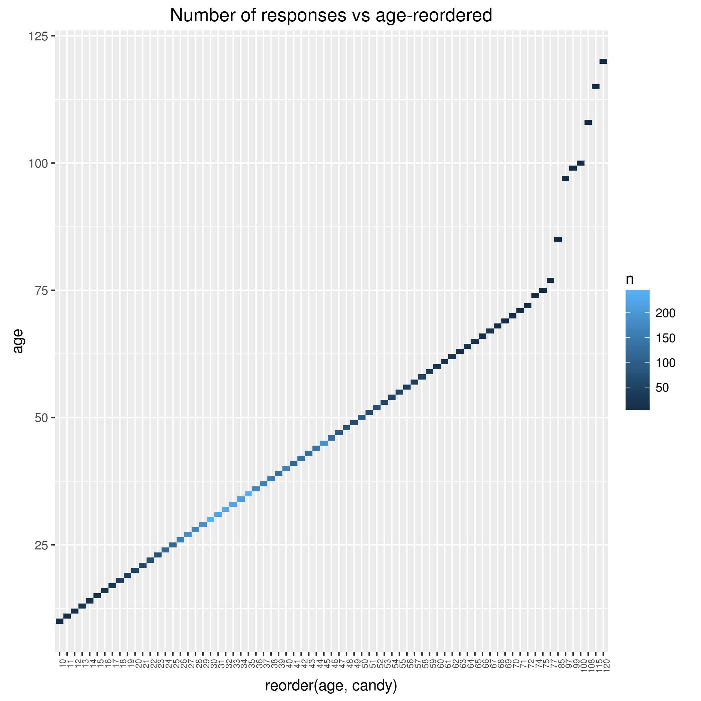
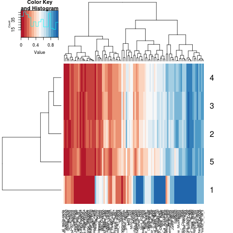
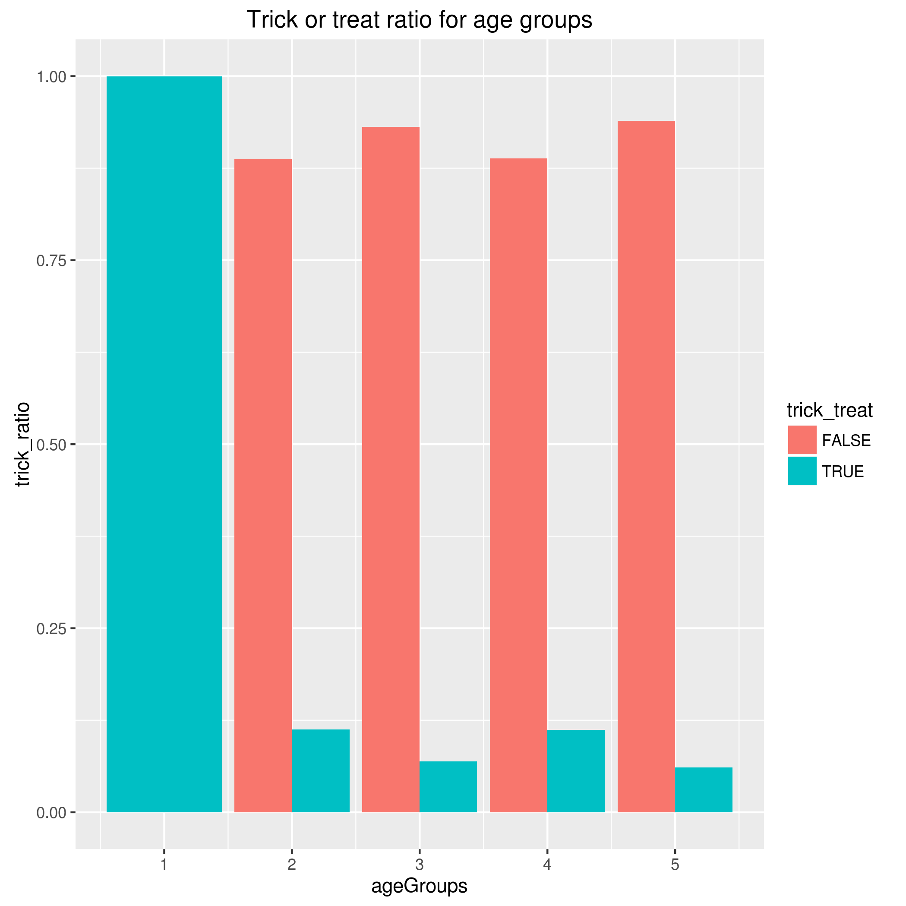

```{r setup, include=FALSE}
knitr::opts_chunk$set(echo = TRUE)
options(knitr.table.format = 'markdown')
```


Here's the Rmarkdown file for reporting the candy survey data wrangling automation pipeline.
This document is made as the reporting stage of the pipeline.
Also,its purpose is to allow us to demonstrate how to use `rmarkdown::render()` without the help of RStudio's buttons. We will, in fact, call `rmarkdown::render()` from within a Makefile.

+ Note: The candy survey was first explored in [Homework7](https://github.com/STAT545-UBC/golnaz_jahesh/tree/master/STAT547_Homework/Homework7), where all the steps of data cleaning, wrangling and exploration is define din details.

## Analyzing the clean data 

The clean data is called `cand_tidy` and is the result of the data wrangling is `01_data-cleaning.R` script.
```{r}

suppressPackageStartupMessages(library(dplyr))
library(readr)

```

```{r}
candy_tidy <- read_csv("candy_clean.csv")
str(candy_tidy)
nrow(candy_tidy)
ncol(candy_tidy)
candy_tidy %>% head(10) %>% knitr::kable()
```

####Number of responses vs. age



**Analysis :**  

It looks like the age group of 30 to 35 years old, had the most number of responses in the candy survey.

### Candy Likability within certain age groups



The groups are calculated with in the `age_grouper` function ( please look at `02_explor-data-plot.R` script) and are as follow:  

* Group 1: Age<=10  
* Group 2: 10<Age<=29
* Group 3: 29<Age<=35
* Group 4: 35<Age<=44
* Group 5: Age>=44  

**Analysis :**

It looks like the popular brands such as *kitkat*, *Twix*,*Reese_Peanut_Butter_Cups* , etc, seem to be most popular within all the age groups.  
Some candies like *fuzy peaches* or *chicklets* are more popular among children under 10 (age group = 1). Same with *Candy from baseball card* or the *candy_that_is_clearly_just_the-suff_given_out_for_free_at_the_restaurants* are more likable by kids!

Also *Full Sized Candy bars* seems to be the most popular candy within age group 2 and 3, i.e respondents from 29 to 35 years old. 

And also it looks like healthy stuff like *health bar* is more favorable by group 5, i.e people older than 44 years old.  

However based on the sample size i.e the number of respondents in each group the result for group 1 (kids) and group 5 is not that reliable.This is because the size of these groups are not comparable with the remaining groups.

###Trick or treat?



**Analysis :** 
It looks like the maximum rate of trick or treat-ers belong to the Group 1 ( kids!) within their group, where everyone goes trick or treating! Group 2 and 4 seems to have the next high rate of trick or treat goers which is approximately , 11% of their individual population.  
Again based on the group size the result for group#1 and group#5 is not that reliable. 
