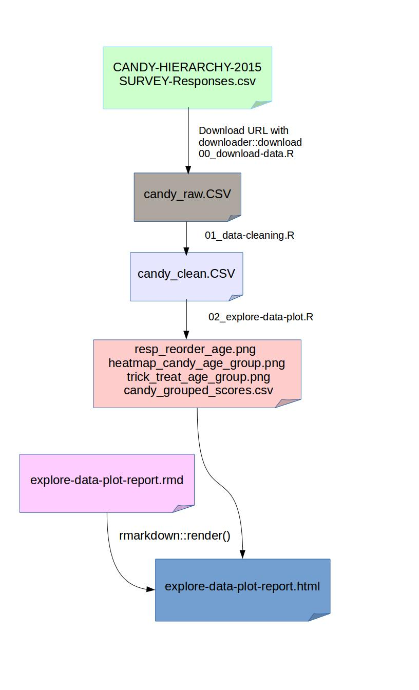

# automation
made for homework9 automation task

### STAT547 Homework9 - Automation
Golnaz Jahesh

This project is created for [Homework9](http://stat545-ubc.github.io/hw09_automation.html#big-picture) of [STAT547](http://stat545-ubc.github.io/) course. 

The aim is showing how to create a small-but-automated analytical pipeline using a Makefile AND using rmarkdown::render() on plain R scripts and R Markdown files, without the help of RStudio's buttons.

Demonstration Data : The raw data from the [Candy Survey](http://boingboing.net/2015/10/31/the-candy-hierarchy-2015-your.html) is the survey [David Ng](https://twitter.com/ng_dave) and [Ben Cohen](https://twitter.com/somelaterdate) put together.
You can read their article here in [2015 Candy Hierarchy](http://boingboing.net/2015/10/31/the-candy-hierarchy-2015-your.html) and look
at the survey's [google spreadsheets](https://docs.google.com/spreadsheets/d/1REZvjqv0lj3dEYb0CsGyDXkXrjhJ4izlAEImgaufjCc/pubhtml).

The flow of the pipeline is as follow:

Suggested workflow is as follow:

1. Clone this directory. For example, clone the entire course repo, which includes this directory.
2. Start a fresh RStudio session, make sure this directory is the working directory.
3.Run any scripts you like interactively.
4. Run any script you like at arm's length, via source() or RStudio Source button.
5. In a shell, experiment with commands like these to cause scripts to be run:
6. make `candy_raw.csv` (replace candy_raw.csv with other targets)
7. make clean
8. make all

+ Note : You could always use Rsrudio -> Build -> Clean all/Build all if you are using the Shell.  

